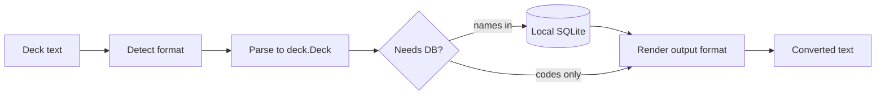

# Riftport

A lightweight terminal application for **Riftbound** deck conversion.

Riftport converts decklists between common text formats. Card metadata lives in a local SQLite database that you refresh manually. Conversion never calls the Riot API or any remote service at runtime.

## Core philosophy

Separate responsibilities:

```text
update-db   → acquire/update card metadata
convert     → transform deck text (multi-input aware)
inspect     → query local database
search      → search local index
```

| Command     | Network? | Purpose                                      |
|-------------|----------|----------------------------------------------|
| `update-db` | Yes      | Download card data into the local database   |
| `convert`   | No       | Parse and render decklists between formats   |
| `inspect`   | No       | Look up a single card by ID or code          |
| `search`    | No       | Fuzzy search the local FTS index             |

## Install

Requires Go 1.23+.

```bash
go install ./cmd/riftport
```

Or build locally:

```bash
go build -o riftport ./cmd/riftport
```

## Quick start

```bash
# 1. Refresh local card data (run whenever you want newer cards)
riftport update-db

# 2. Convert a deck (auto-detects input format by default)
echo 'OGN-265-1 OGN-246-1' | riftport convert --to names

# 3. Search and inspect offline
riftport search "Jinx"
riftport inspect OGN-265
```

Default database path: `~/.riftport/cards.db` (override with `--db`).

## Commands

### `update-db`

Fetches a complete card snapshot from the [RiftCodex](https://riftcodex.com) public API and installs it atomically. If RiftCodex is unavailable, the command automatically falls back to [RiftScribe](https://riftscribe.gg). The selected source is shown in the command output and stored in database metadata.

```bash
riftport update-db
riftport update-db --db ./my-cards.db
```

### `convert`

Transforms deck text between supported formats. Reads from a file argument or stdin.

```bash
riftport convert deck.txt --from auto --to tts
cat deck.txt | riftport convert --from piltover --to deckcode
```

**Input formats** (`--from`):

| Format      | Description                                                |
|-------------|------------------------------------------------------------|
| `auto`      | Detect deckcode, pixelborn, TTS, or name/sectioned text    |
| `names`     | `3 Jinx, Loose Cannon` lines                               |
| `piltover`  | Sectioned list (Legend, Main Deck, Battlefields, Runes)    |
| `tcgarena`  | TCG Arena positional list with a Sideboard section         |
| `tts`       | Space-separated `OGN-265-1` tokens                         |
| `pixelborn` | Base64-encoded `$`-separated TTS tokens                    |
| `deckcode`  | Piltover Archive / RiftMana share codes (`CI…`)            |

**Output formats** (`--to`): `names`, `piltover`, `tcgarena`, `tts`, `pixelborn`, `deckcode`

Name-based output requires a populated local database. Code-based formats (`tts`, `pixelborn`, `deckcode`) work without name resolution.
Name lookup ignores provider-specific punctuation, spacing, and case, so names such as `Jayce, Defender of Tomorrow` and `Jayce - Defender of Tomorrow` resolve to the same card.

### `inspect`

```bash
riftport inspect OGN-265
riftport inspect ogn-265-298
```

### `search`

```bash
riftport search "herald of" --limit 10
```

Uses SQLite FTS5 trigram matching over name, set, type, and faction.

## Architecture

```text
cmd/riftport/          CLI entrypoint
internal/
  cmd/                 Cobra commands (update-db, convert, inspect, search)
  cards/               Card model and code parsing (OGN-265, TTS tokens)
  database/            SQLite storage + FTS5 search index
  deck/                Canonical deck representation (main, sideboard, sections)
  fetch/               RiftCodex acquisition + RiftScribe fallback
  convert/
    convert.go         Detect → parse → resolve → render pipeline
    formats/           Per-format parsers and writers
    deckcode/          Piltover Archive deck code codec (base32 + varint)
```

### Conversion pipeline



1. **Detect** — `auto` mode picks deckcode, pixelborn, TTS, or name/sectioned text.
2. **Parse** — Each format produces a canonical `deck.Deck` with card refs and counts.
3. **Resolve** — Name-based inputs look up cards in the local DB; code-based paths skip this.
4. **Render** — The target format writer emits the final string.

### Data flow

- **update-db** is the only command that touches the network.
- **convert**, **inspect**, and **search** read only from the local database.
- No background sync, no runtime API dependency during conversion.

## Supported formats (examples)

**Names**

```text
3 Seal of Unity
1 Viktor, Herald of the Arcane
```

**Piltover / sectioned**

```text
Legend
1 Viktor, Herald of the Arcane

Main Deck
3 Seal of Unity
```

**TTS**

```text
OGN-265-1 OGN-246-1 OGN-245-1
```

**Pixelborn** — base64 of `OGN-265-1$OGN-246-1$…`

**Deck code** — share strings beginning with `CI`, per the [Piltover Archive deck code spec](https://github.com/Piltover-Archive/RiftboundDeckCodes).

## License

MIT
